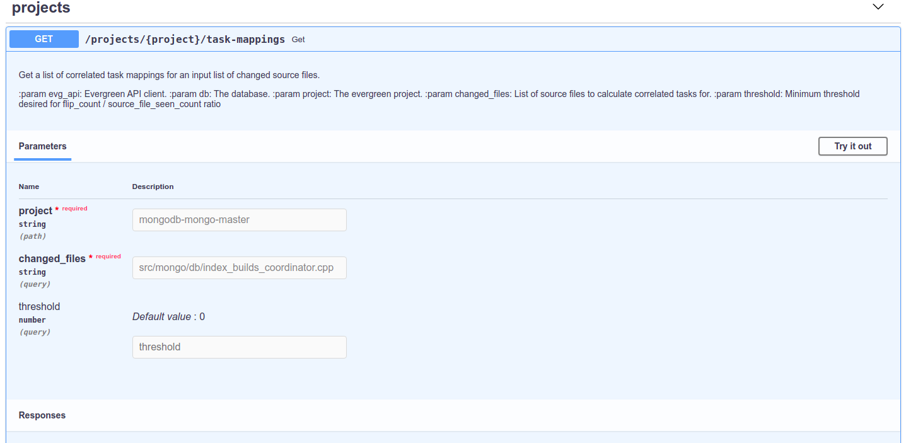
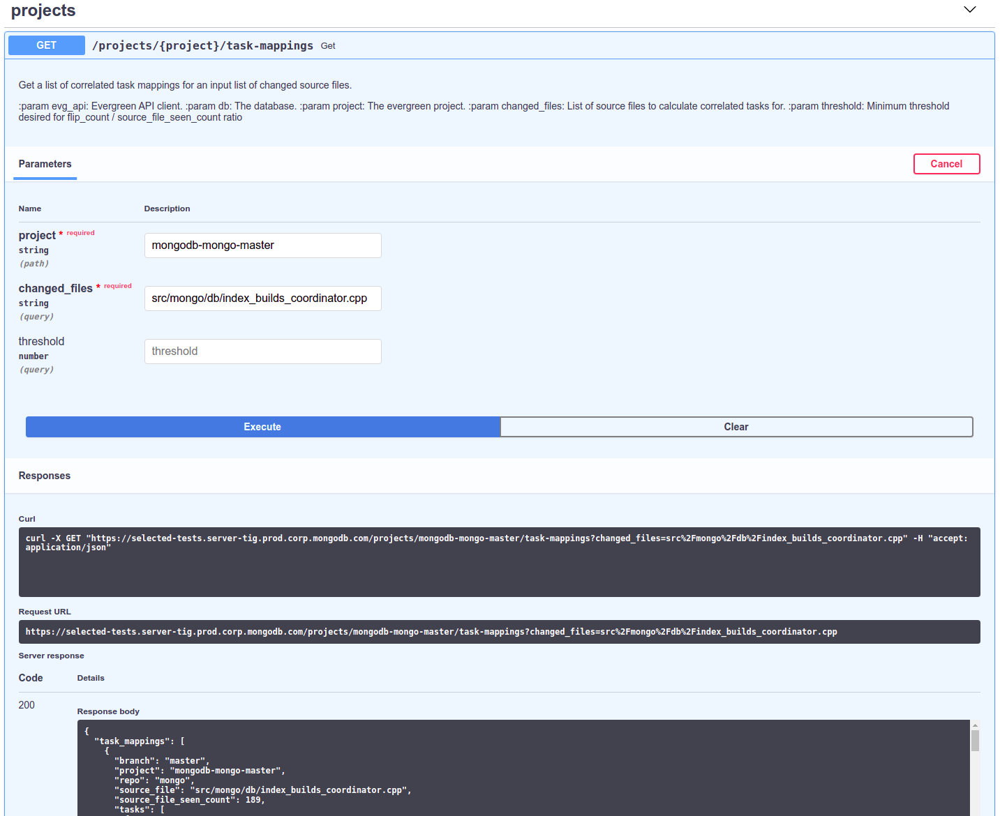

# Selected Tests

The Selected Tests service is used to predict which tests need to run based on code changes.

## Introduction

This documment briefly introduces the Selected Tests API. For more detailed information,
refer to the [Further Reading](#further-reading) section at the end of this document. 

## Selected Tests API

The selected-tests API is hosted internally at MongoDB. For this reason we restrict access to
engineers who are authenticated through CorpSecure (MongoDB's Single Sign On solution for internal
apps).

### Accessing Selected Test API

Assuming that you have followed [these instructions](docs/ManuallyRunning.md) and a web serice is running on **https://localhost:8080**,
then the easiest mechanism to access the API is to use [project swagger page](https://localhost:8080/swagger),

This page lists all the endpoints, at the moment the most interesting for an end user are:
 * [GET get projects task mappings](https://localhost:8080/swagger#/projects/get_projects__project__task_mappings_get)
 * [GET get projects test mappings](https://localhost:8080/swagger#/projects/get_projects__project__test_mappings_get)

Navigate to either of the 2 links listed above and click the **Try It Out** button on the right hand side of the panel.

For example, the [GET project task-mappings](https://localhost:8080/swagger#/projects/get_projects__project__task_mappings_get) command panel looks like:

Next enter the following details:
 * **mongodb-mongo-master** for the mandatory **project** field.
 * **src/mongo/db/index_builds_coordinator.cpp** for the mandatory **changed_files** field.
 
The threshold field is optional so leave it empty.

Now the [GET project task-mappings](https://localhost:8080/swagger#/projects/get_projects__project__task_mappings_get) command panel should look like:

Click the blue **Execute** button below the parameters panel.

The response body field on the panel will display the test or task mappings discovered for the project and files entered (you
can see some of the results at the bottom of the previous image).

This would be the equivalent of changing only the **src/mongo/db/index_builds_coordinator.cpp** file
in a mongo branch and issuing the `evergreen patch` command(above). 

You can also view the mappings from the command line. See [Curl Mappings](docs/ManuallyRunning.md#curl-mappings) for more details. 
If you are trying to access the MongoDB service then you will also need to [Authenticate](docs/MongoService.md#authentication).

If any new endpoints are added to the service or if the service is updated in such a way that any of
the existing endpoints' contracts change, the swagger documentation must be updated to reflect the
new state of the service before that change can be merged to master.

Documentation for how the swagger documentation is done can be found
[here](https://flask-restplus.readthedocs.io/en/stable/swagger.html).

# Further Reading 

More detailed about the Selected Test service is contained in the following: 
 * [Manual Commands](docs/ManuallyRunning.md): run the service manually.
 * [Mongo Service](docs/MongoService.md): details of the selected tests service usage within MongoDB. 
 * [Contributing](docs/Contributing.md): guide to contribute to this project.
  
