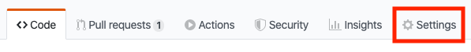

# Selected Tests

The Selected Tests service is used to predict which tests need to run based on code changes.

# System Requirements

This project requires:
 * Github access
 * A MongoDB database
 * Python (version >= 3.7).
 * [Python Poetry](https://github.com/python-poetry/poetry) to manage the python components.
 * [Evergreen Access](https://github.com/evergreen-ci/evergreen).

# Project Components

The system is composed of:
 * This repository.
 * A [MongoDB database](https://www.mongodb.com/)
 * An ASGI web service (based on [FastAPI](https://github.com/tiangolo/fastapi))
 * A set of command line tools to update the database
 * A set of supporting shell scripts to create the supporting indexes and launch the web service.
 
## Before you start

Let's set up the system requirements.

You must have:
  * access to a github repository.
  * a MongoDB database.
  * python (>= 3.7).
  * Evergreen Access.

We will discuss each in turn in the following sections.
 
### <a name="GithubAccess"></a>Github Access
 
The selected tests project needs to be given access in order to access private repositories. This
access is granted via ssh keys. To give selected tests access to your repository, you will need
to add the selected tests public key as a deploy key in github. 

#### Getting the public key

Ask the selected tests administrator for the public key. The [following guide](https://help.github.com/en/github/authenticating-to-github/generating-a-new-ssh-key-and-adding-it-to-the-ssh-agent)
to create a new set of keys and upload them to your githiub account to enable access. For now, we will assume
that your keys are in ~/.ssh/selected_tests and ~/.ssh/selected_tests.pub.

#### Adding the public key to your project

1. Go to repo settings in github

   

2. Select the Deploy Keys section of settings

   

3. Select Add Key

   

4. Add the public key for selected tests

   

### MongoDB
 
The recommended MongoDB configuration for this project is a 3 node replica set. Currently in-house we use a 3 node
replica set (Primary / Secondary / Secondary)  deployed in [MongoDB Atlas](https://www.mongodb.com/cloud/atlas)
on M5 instances (see [free shared and dedicated cluster comparison](https://docs.atlas.mongodb.com/cluster-tier/#free-shared-and-dedicated-cluster-comparison)).

Use one of the following options to setup your MongoDB database and ensure that you can access it:
 * [Atlas Getting Started](https://docs.atlas.mongodb.com/getting-started/)
 * [MongoDB Community](https://docs.mongodb.com/manual/administration/install-community/)
 

### Python

This project targets python versions greater than or equals to python 3.7. 

**Note**: we recommend that you use some form of [python virtual env](https://docs.python-guide.org/dev/virtualenvs/)
manager. The following commands use [pyenv](https://github.com/pyenv/pyenv) to manage both the python
version and virtual environments, but you can use whatever you wish.   

The following commands install python 3.7.7 (the latest 3.7 at this time), creates a new
selected_test virtual env and then activates it:

```shell script
# These next 2 steps are only required once.
pyenv install 3.7.7
pyenv virtualenv 3.7.7 selected_tests
# The next step will be needed in every shell
pyenv activate selected_tests
```

### Poetry

Use the following instructions to [Install poetry](https://github.com/python-poetry/poetry#installation).

### Evergreen

You will need to set your Evergreen credentials in environment variables because the application
and CLIs authenticate to Evergreen using $EVG_API_USER and $EVG_API_KEY. You can set these to the
values in your local ~/.evergreen.yml file.

```shell script
$ export EVG_API_USER=$(python -c "import yaml; import sys; cfg = yaml.safe_load(sys.stdin); print(cfg['user'])" < ~/.evergreen.yml)
$ export EVG_API_KEY=$(python -c "import yaml; import sys; cfg = yaml.safe_load(sys.stdin); print(cfg['api_key'])" < ~/.evergreen.yml)
```

**Note** from here on, we will assume that **EVG_API_USER** and **EVG_API_KEY** are set.

# Project Components

Now that we have installed and configured all the prerequisites we can begin to configure and run the
selected-tests project.
 
## Download and Install Selected Tests
 
Now that you have installed the system dependencies, run the following commands to install the project requirements:

```shell script
$ git clone git@github.com:mongodb/selected-tests.git
$ cd selected-tests
$ poetry install
```

## Selected Tests Commands

At this point, you should have the various commands available:
* **init-mongo**: Setup the MongoDB database. This command should be run to configure a new databas
or to update an existing one.
* **task-mappings**: gather unprocessed task mappings create requests and process them so that task
mappings for those projects are added to the db. This command should be run daily.
* **test-mappings**: gather unprocessed test mappings create requests and process them so that test
mappings for those projects are added to the db.  This command should be run daily.
* work-items: Update models,  these commands should be run daily.
  * **process-task-mappings**: update the task mappings models. This jobs look at all git commits
and mainline patch builds from the previous day and create new task mappings.
  * **process-test-mappings**: update the task mappings models. This jobs look at all git commits
and mainline patch builds from the previous day and create new test mappings.
* **selected-tests-service**: the selected tests web service entry point. 

  
## Configure MongoDB
 
Assuming you have deployed a local mongodb instance on the default port and you can access it with the mongo
shell, then you create the required indexes with the following command:

```shell script
$ export SELECTED_TESTS_MONGO_URI=localhost:27017
$ init-mongo create-indexes
{"message": "Adding indexes for collection", "lineno": 24, "filename": "datasource_cli.py", "collection": "test_mappings_queue", "logger": "selectedtests.datasource.datasource_cli", "level": "info"}
{"message": "Adding indexes for collection", "lineno": 24, "filename": "datasource_cli.py", "collection": "task_mappings_queue", "logger": "selectedtests.datasource.datasource_cli", "level": "info"}
{"message": "Adding indexes for collection", "lineno": 45, "filename": "datasource_cli.py", "collection": "test_mappings", "logger": "selectedtests.datasource.datasource_cli", "level": "info"}
{"message": "Adding indexes for collection", "lineno": 45, "filename": "datasource_cli.py", "collection": "task_mappings", "logger": "selectedtests.datasource.datasource_cli", "level": "info"}
{"message": "Adding indexes for collection", "lineno": 73, "filename": "datasource_cli.py", "collection": "test_mappings_test_files", "logger": "selectedtests.datasource.datasource_cli", "level": "info"}
{"message": "Adding indexes for collection", "lineno": 60, "filename": "datasource_cli.py", "collection": "task_mappings_tasks", "logger": "selectedtests.datasource.datasource_cli", "level": "info"}
```

Or:

```shell script
$ init-mongo --mongo-uri localhost:27017 create-indexes
```

If you are using an Atlas instance which includes authentication, then you would use something like the following:

```shell script
export SELECTED_TESTS_MONGO_URI=mongodb+srv://<username>:<password>@<atlas>.mongodb.net/
$ init-mongo create-indexes
``` 

Refer to the [Atlas connect to cluster](https://docs.atlas.mongodb.com/connect-to-cluster/) for instructions on how to access your cluster uri.  

**Note** from here on, we will assume that **SELECTED_TESTS_MONGO_URI** is set.

## Launch Web Service

```shell script
$ export EVG_API_USER=$(python -c "import yaml; import sys; cfg = yaml.safe_load(sys.stdin); print(cfg['user'])" < ~/.evergreen.yml)
$ export EVG_API_KEY=$(python -c "import yaml; import sys; cfg = yaml.safe_load(sys.stdin); print(cfg['api_key'])" < ~/.evergreen.yml)
$ export SELECTED_TESTS_MONGO_URI="localhost:27017"
$ uvicorn --host 0.0.0.0 --port 8080 --workers 1 selectedtests.app.asgi:app --reload
```

__Note__: reload is only used in development mode.

## <a name="GenerateTestTaskMappings"></a>Generate test and task mappings 

Use the following commands to create the test and task mappings for **mongodb-mongo-master**.

```shell script
$ export SELECTED_TESTS_URI=http://localhost:8080
$ export SELECTED_TESTS_PROJECT=mongodb-mongo-master 
$ curl  -X POST ${SELECTED_TESTS_URI}/projects/${SELECTED_TESTS_PROJECT}/test-mappings \
        -d '{"source_file_regex":"^src/mongo", "test_file_regex":"^jstests"}' \
        -H "Content-Type: application/json"
$ curl -X POST ${SELECTED_TESTS_URI}/projects/${SELECTED_TESTS_PROJECT}/task-mappings \
       -H 'accept: application/json' \
       -H 'Content-Type: application/json' \
       -d '{ "source_file_regex": "^src/mongo", "module": "enterprise", "module_source_file_regex": "^src", "build_variant_regex": "^!"}'
``` 

Now that the mappings have been created, we must populate them.

## Populating the mappings.
 
You should run the `process-test-mappings` and `process-task-mappings` commands once every
day (see [Generate test and task mappings](#GenerateTestTaskMappings)) . This will gather the
unprocessed test mapping create and task mapping create requests and process them so that test and
task mappings for those projects are added to the db.

You should run the `test-mappings update` and `task-mappings update` daily to update the test and
task mappings models. These jobs look at all git commits and mainline patch builds from the previous
day and create new test mappings and task mappings respectively.

Assuming your [github keys](#GithubAccess) were created and are in  **~/.ssh/selected_tests_rsa**,
you can run the following commands.

```shell script
$ eval "$(ssh-agent -s)"
$ ssh-add -k ~/.ssh/selected_tests_rsa
$ export EVG_API_USER=$(python -c "import yaml; import sys; cfg = yaml.safe_load(sys.stdin); print(cfg['user'])" < ~/.evergreen.yml)
$ export EVG_API_KEY=$(python -c "import yaml; import sys; cfg = yaml.safe_load(sys.stdin); print(cfg['api_key'])" < ~/.evergreen.yml)
$ export SELECTED_TESTS_URI=http://localhost:8080

# The following commands may take some time to run.
$ poetry run test-mappings --log-format json update
$ poetry run work-items --log-format json process-test-mappings

# The following commands may take some time to run.
$ poetry run task-mappings --log-format json update
$ poetry run work-items --log-format json process-task-mappings
```

As noted, the test / task mapping update and test / task work-item commands should be run daily to
ensure that your mapping are kept up to date. 

# View Selected Tests Service mappings 

You can use the swagger access page or the command line to view the Selected Tests Service Mappings.

# <a name="ViewMappings"></a>Swagger 

You can view the mappings on the [swagger page](http://localhost:8080/swagger) for the web-service.

This assumes that the service is running on **http://localhost:8080**.

See [Selected Test Swagger API](../README.md#SelectedTestSwaggerAPI).

Documentation for how the swagger documentation is done can be found
[here](https://flask-restplus.readthedocs.io/en/stable/swagger.html).

## <a name="CurlMappings"></a>Curl Mappings 

Alternatively, you can also view the data from the command line with the following command:

```shell script
$ export SELECTED_TESTS_URI=http://localhost:8080
$ curl "${SELECTED_TESTS_URI}/projects/mongodb-mongo-master/test-mappings?changed_files=src/mongo/db/write_concern.cpp" --silent | jq .
$ curl "${SELECTED_TESTS_URI}/projects/mongodb-mongo-master/task-mappings?changed_files=src/mongo/db/write_concern.cpp" --silent | jq .
```
**NOTE**: [jq](https://stedolan.github.io/jq/) pretty prints the data.
**NOTE**: If you are trying to access the MongoDB service then you will also need to [Authenticate](docs/MongoService.md#Authentication).