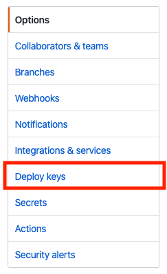
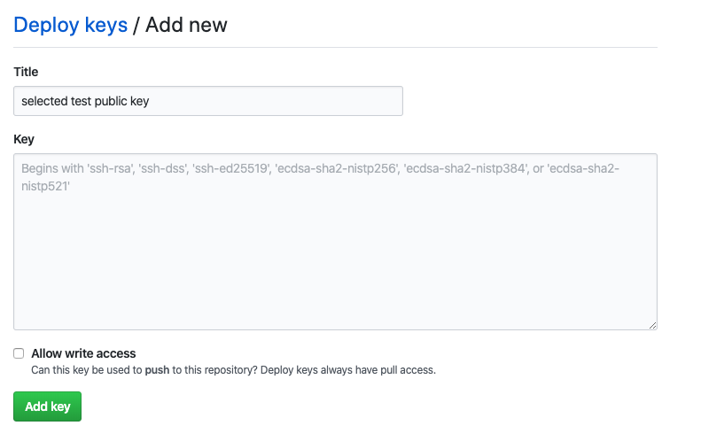

# Adding private repositories

The selected tests project needs to be given access in order to access private repositories. This
access is granted via ssh keys. To give selected tests access to your repository, you will need
to add the selected tests public key as a deploy key in github. 

## Getting the public key

Ask the selected tests administrator for the public key.

## Adding the public key to your project

1. Go to repo settings in github

   

2. Select the Deploy Keys section of settings

   

3. Select Add Key

   

4. Add the public key for selected tests

   
